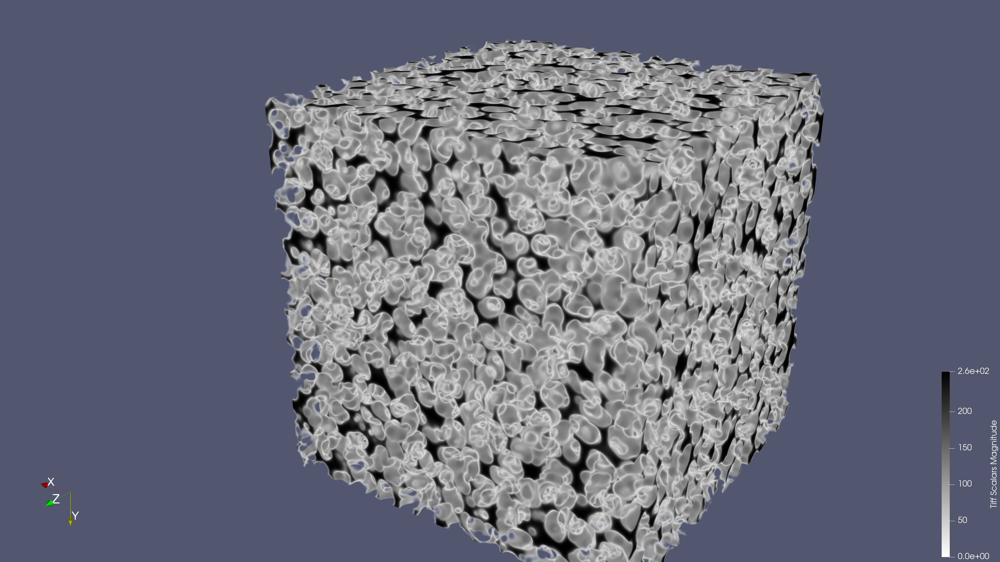

Free volume in a simulated sample of polystyrene.

# VACUUMMS

**VACUUMMS (Void Analysis Codes and Unix-like Utilities for Molecular Modeling and Simulation) is a collection of codes developed over the course of a research career, specifically for analyzing Free Volume in materials.**

Beginning with version 1.3.0, VACUUMMS development focuses on the C++ interface, which in turn supports the python interface. The original command line interface and utilities still exist and shall remain largely unchanged, however they are now considered deprecated in favor of the new interfaces, when available. See the JuPyter examples below for an introduction.

## LICENSE

  Copyright (C) 2003-2025 Frank T Willmore

  Permission is hereby granted, free of charge, to any person obtaining a 
  copy of this software and associated documentation files (the "Software"), 
  to deal in the Software without restriction, including without limitation 
  the rights to use, copy, modify, merge, publish, distribute, sublicense, 
  and/or sell copies of the Software, and to permit persons to whom the 
  Software is furnished to do so, subject to the following conditions:

  The above copyright notice and this permission notice shall be included 
  in all copies or substantial portions of the Software.

  THE SOFTWARE IS PROVIDED "AS IS", WITHOUT WARRANTY OF ANY KIND, EXPRESS 
  OR IMPLIED, INCLUDING BUT NOT LIMITED TO THE WARRANTIES OF MERCHANTABILITY, 
  FITNESS FOR A PARTICULAR PURPOSE AND NONINFRINGEMENT. IN NO EVENT SHALL 
  THE AUTHORS OR COPYRIGHT HOLDERS BE LIABLE FOR ANY CLAIM, DAMAGES OR OTHER 
  LIABILITY, WHETHER IN AN ACTION OF CONTRACT, TORT OR OTHERWISE, ARISING 
  FROM, OUT OF OR IN CONNECTION WITH THE SOFTWARE OR THE USE OR OTHER 
  DEALINGS IN THE SOFTWARE.

## CITATION

  Please reference the following publication/doi in citing this work:

  A toolkit for the analysis and visualization of free volume in materials

  Frank T Willmore

  Proceedings of the 1st Conference of the Extreme Science and Engineering 
    Discovery Environment: Bridging from the eXtreme to the campus and beyond
  Article No. 30 

  ISBN: 978-1-4503-1602-6 doi:10.1145/2335755.2335826

  https://dl.acm.org/doi/abs/10.1145/2335755.2335826

## ADDITIONAL REFERENCES

 Thesis for which original codes were developed: https://repositories.lib.utexas.edu/handle/2152/3515

 [Original white paper describing the software]: (share/doc/VACUUMMS_paper.pdf)

 [Slides from AICHE 2025]: (share/doc/AICHE 2025.pdf)

 Videos: https://www.youtube.com/playlist?list=PLb1z5T_SBfZgV0-0qzXOeYTgL8NkGST2w

## INSTALLATION

### via spack

Get spack:

`$ git clone https://github.com/spack/spack`

Activate spack:

`$ . spack/share/spack/setup-env.sh`

Install:

`$ spack install vacuumms`

Load into the user environment:

`$ spack load vacuumms`

### via CMake

VACUUMMS can also be installed using the CMake build system generator:

`$ git clone https://github.com/VACUUMMS/VACUUMMS`
`$ cd VACUUMMS`
`$ mkdir cmake`
`$ cd cmake`
`$ ccmake ..`

Select the desired options from the ccmake generator screen, generate, and exit ccmake. Then invoke make to build VACUUMMS:

`$ make`
`$ make install`

### via Conda 

VACUUMMS can also be installed using conda/mamba. There is a pre-built conda binary, or it can be built from source following instructions at:

[BUILDING_AND_USING CONDA_PACKAGE](BUILDING_AND_USING_CONDA_PACKAGE.md)

## USER GUIDES

[IO Formats](share/doc/IO_FORMATS.md)

[Applications User Guide](share/doc/APPLICATIONS_USER_GUIDE.md)

[Utilities User Guide](share/doc/UTILITIES_USER_GUIDE.md)

## DEVELOPER GUIDES

[Developer Guide](share/doc/DEVELOPER_GUIDE.md)

[Roadmap](share/doc/ROADMAP.md)

[Release Notes](share/doc/RELEASE_NOTES.md)

## EXAMPLES

[JuPyter](examples/jupyter) - Examples using the JuPyter/python interface to the C++ library and variational module. Includes PDF of complete notebooks as well as the .ipynb (JuPyter) code used to create them. 

[Variational](examples/variational/EXAMPLES.md) - Examples using the C++ interface and variational module.

[Polystyrene](examples/CLI/polystyrene/README.md) - An example using the original CLI (command line interface) and bash scripts.

---

Those interested in using VACUUMMS software are encouraged and invited to reach out directly for assistance.
