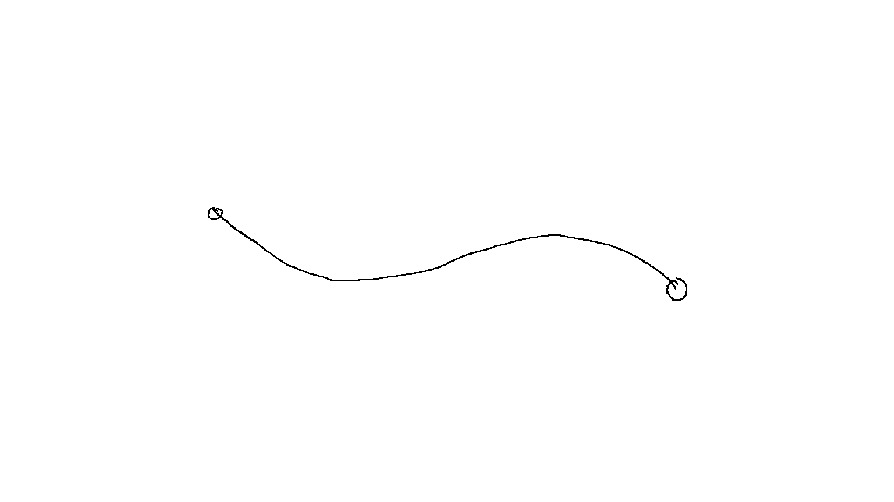
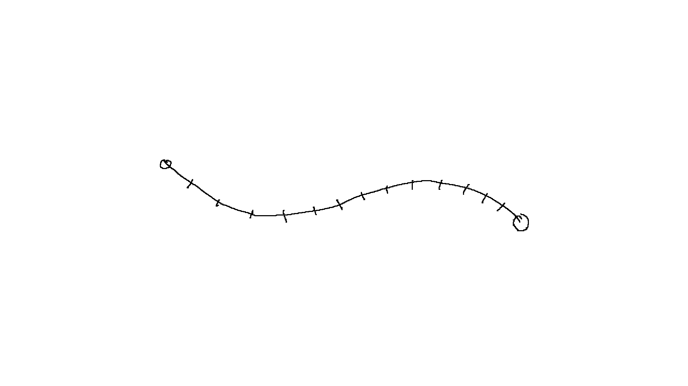

# VACUUMMS variational module

The variational module is an extension to VACUUMMS that allows for finding the paths of least insertion energy along the insertion energy landscape. 



## Overview

Taking the set of pairs of Voronoi vertices (in lieu of CESA cavity centers, which are nearly identical but which lack the implicit pairing of Voronoi edges) as input. The following protocol is applied for each edge:

- End points and an insertion energy function (or molecular configuration) are taken as input. A set of evenly spaced points (the variational points) is created between these endpoints, comprising the variational path. 

  

- An gradient descent is performed for the variational curve by calculating insertion energy gradients for each of the variational points, then shifting the entire variational curve to the updated points. The gradients are calculated in the plane perpendicular to the variational path at each variational point, using directional derivatives of the energy:

  <image of perpendicular>

  Calling the `iterate()` function causes this process to be repeated for the set of variational points along the variational curve, each being evaluated individually before updating the entire curve to the perturbed points. Thus the entire curve is shifted simultaneously.

- Since these perturbations invariably cause an uneven stretching of the curve, a `rebalancePoints()` method is provided that performs an adaptive re-spacing of points evenly along the variational curve:

  <image of respacing>

- Convergence criteria of the curve to the variational limit have not yet been implemented. A likely candidate is when it is determined that mean-square-displacement of variational points falls below a threshold value with each successive iteration, or alternatively, a fixed number of iterations is performed. 

## Calculation of gradient in perpendicular plane

Each variational point *p* is neighbored by a point before and a point after (one of being the start or end point of the variational curve itself for the first and last variational points, respectively). These two neighboring points are used to define an axis perpendicular (within numerical approximation) to the variational curve at the variational point of interest. Let these points be represented as **p_fore** and **p_aft** and the unit vector **n** tangent to the variational curve as:

​		**n = (p_aft - p_fore)** /  **| p_aft - p_fore |**  

The direction of these derivatives is derived by rotating the (x, y, z) coordinate system such that the z-axis points in the direction **n** of the variational path at the variational point being evaluated. The parameters of this rotation are determined from mapping **k**, the unit vector in the z-direction to **n**.

This mapping of the original coordinate system is done by finding a rotation axis **u** and an angle of rotation *theta* resulting in the unit vector **k** mapping to the unit vector **n**. The same rotation maps the **i** and **j** unit vectors (pointing along the original x and y axes) to orthogonal vectors **directional_x** and  **directional_y**, forming a basis set that spans the plane perpendicular to the variational path at the point of interest.

The axis of rotation **u** can be taken from the cross product:

 ~~**k** X **n** emits an axis of rotation **u** from **k** to **n** plus a signed quantity *phi*, -1 < *phi* < 1 which for small angles, is equal to the sine of the angle between **k** and **n**:~~

​		~~|**k** X **n**| = |**k**||**n**||*phi*|;~~

~~The sign of phi depends on the direction of rotation; positive from **k** to **n**, and changing its sign is equivalent to swapping rows in the determinant below:~~

					 |	 i	 j	 k	 |
			k X n =	 |	 0	 0	 1	 |
					 |	n_x	n_y	n_z	 | 

where **u** is a unit vector pointing in the direction of the cross product:

​		**u** = **k** X **n** / |**k** X **n**|


The value of *theta* can most efficiently be extracted from the dot product:

​		**k** * **n** = |**k**||**n**|cos(*theta*)

​		theta = arccos(**k * n**)

This gives values of theta ranging from -PI/2 to PI/2. For rotations larger/smaller than this range, the direction of rotation emerges as an inverted sign in the value of the cross product, i.e. a rotation angle greater or less than values in this range is described by a rotation about an axis pointing in the opposite direction. 

The angle *theta* and the axis **u** define the following quaternion-based mapping of the rotation:

​		***q** = cos(theta/2) + **u** sin(theta/2)*

​		**v'** = **qvq*** 

where **v** is the original vector and **v'** is the vector in the rotated coordinate system, and **q*** is the quaternion conjugate of **q**. Thus, **k** rotates to **n** and by definition, **i** and **j** rotate to **directional_x** and **directional_y** respectively. These directionals are used to evaluate the directional gradient in the potential field E and thus generate perturbations:

​		**p_n+1** = **p_n** + *alpha* * ***grad*** E(**p_n**)

#### Example of rotation

Consider a variational point where the variational curve points in the direction (1,1,1). Let *a* = *sqrt(*3*)*/3 and b = sqrt(2). The unit vector **n** is thus (*a, a, a*). Mapping **v** = **k** (unit vector in z-direction) to **v' = n** means evaluating the cross product determinant:

					  |	 i	 j	 k	 |
			k X n =   |	 0	 0	 1	 | = (-a, a, 0)
					  |	 a	 a	 a	 | 

The magnitude of which is:

​		|**k** X **n**| = *sqrt( -a* * -*a* + *a* * *a* ) = *a sqrt*(2) = *ab*

The value of theta is taken from the dot product:

​		**k * n** = a

​		*theta* = *arccos(a)* = 0.955.

and the rotation vector **u** is:

​		**u** = k X n / |k X n| = (*-a, a, 0*) */ab* = (-1, 1, 0) / *b*.

Thus giving the rotation quaternion conjugate pair:

​		**q** = *cos*(*theta/2*) + **u** sin(*theta/2*) = 0.888 - 0.325**i** + 0.325**j**

​		**q*** = *cos*(*theta/2*) - **u** sin(*theta/2*) = 0.888 + 0.325**i** - 0.325**j**

Rotating the **i** and **j** vectors gives the directionals to be used for the gradient:

​		**directional_x** =  **qiq*** = 0.788**i** + 0.212**j** + 0.577**k**

​		**directional_y** = **qjq*** = -0.212**i** + 0.788**j** - 0.577**k**

And as a sanity check, rotating the unit vector **k** should return the original vector **n**, within the limits of numerical precision. Preserving three significant figures here returns:

​		**qkq*** = 0.577**i** + 0.577**j** + 0.576**k** ~ (*a, a, a*)

#### Example 2 of rotation

Consider a variational point where the variational curve points in the direction **n** = (0,1,0) (parallel to y-axis). Mapping **v** = **k** (unit vector in z-direction) to **v'** = **n** means evaluating the cross product determinant:

					|	i	j	k	|
			k X n =	|	0	0	1	|	=	(-1, 0, 0)
					|	0	1	0	| 

In this case, the dot product **k * n** = 0, so:

			theta = arccos(0) = PI/2

and:

			u = k X n / |k X n| = (-1, 0, 0) = -i

Thus giving the rotation quaternion conjugate pair:

		q = cos(PI/4) - i sin(PI/4) = (sqrt(2)/2) (1 - i)
		q* = cos(PI/4) + i sin(PI/4) = (sqrt(2)/2) (1 + i)

Applying this to the vector **v** = (1, 0, 0):

```	**v'** = **qvq*** = (sqrt(2)/2) * (sqrt(2)/2) (1 - i) (i) (1 + i)
	v' = qvq* = (sqrt(2)/2) (1 - i) (i) (sqrt(2)/2) (1 + i)
			  = (1/2) (1 - i) (i) (1 + i)
	          = (1/2) (i - (-1))(1 + i)
	          = (1/2) (i + 1)(1 + i)
              = (1/2) (i + (-1) + 1 + i)
              = i
```

Rotating **v** = **k** to **v'** = **j** around **-i** means that **v** = **i** rotates to itself, as is expected. 


# Prerequisites

Enabling the variational module requires the voronoi module (which in turn requires voro++) to be installed. This integration is handled by CMake and/or spack, but does require that voro++ be available. 


# Developer overview

The variational module is written in C++, and makes use of some existing VACUUMMS code via *'extern "C" '* declarations. Relevant classes are Variational2D and Variational3D which take a set of endpoints, number of variational points to be used, and either a molecular configuration or alternatively, a pointer to a function of x, y, (and z in 3D case) and returns a scalar energy value.


```
class Variational2D
{
    private:

        float start_x;
        float start_y;
        float end_x;
        float end_y;
        int n_var_points;
        Configuration *configuration;
        float(*energy_function)(float x, float y);

        bool use_configuration_energy;

        float* var_x;
        float* var_y;

    public:

        void init(float start_x,
             float start_y,
             float end_x,
             float end_y,
             int n_var_points);

        Variational2D(float start_x,
                      float start_y,
                      float end_x,
                      float end_y,
                      int n_var_points,
                      float(*energy_function)(float x, float y));

        Variational2D(float start_x,
                      float start_y,
                      float end_x,
                      float end_y,
                      int n_var_points,
                      Configuration *c);

        void printValues();
        void iterate();
        void iterateWork();

        ~Variational2D();

        float rebalancePoints2D();

};

class Variational3D
{
    private:

        float start_x;
        float start_y;
        float start_z;
        float end_x;
        float end_y;
        float end_z;
        int n_var_points;
        Configuration *configuration;
        float(*energy_function)(float x, float y, float z);

        bool use_configuration_energy;

        float* var_x;
        float* var_y;
        float* var_z;

    public:

        void init(float start_x,
             float start_y,
             float start_z,
             float end_x,
             float end_y,
             float end_z,
             int n_var_points);

        Variational3D(float start_x,
                      float start_y,
                      float start_z,
                      float end_x,
                      float end_y,
                      float end_z,
                      int n_var_points,
                      float(*energy_function)(float x, float y, float z));

        Variational3D(float start_x,
                      float start_y,
                      float start_z,
                      float end_x,
                      float end_y,
                      float end_z,
                      int n_var_points,
                      Configuration *c);

        void printValues();
        void iterate();
        void iterateWork();

        ~Variational3D();

        float rebalancePoints3D();

};
```

